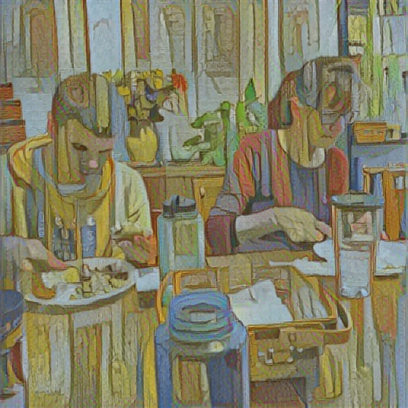

# image_recognition
Convolutional Neural Networks for image recognition

## Neural Style Transfer
family members drawn with van gogh styles  

# Canadian Institute For Advanced Research

# How many fingers?

# Examples of 1D and 2D convolution layers

